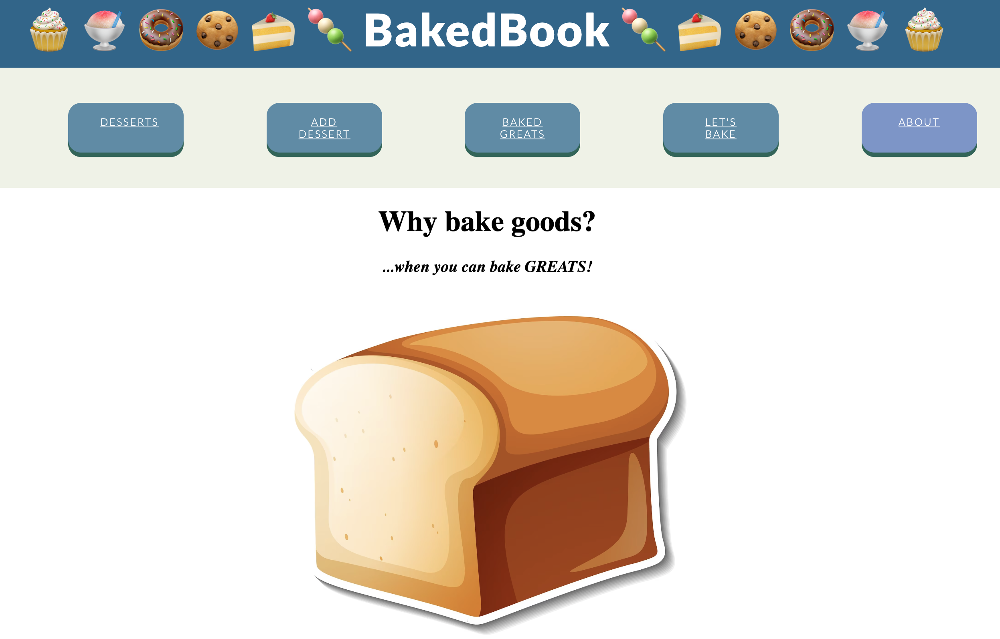
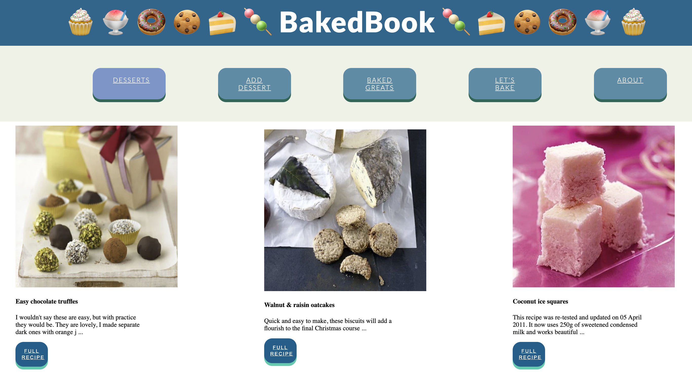
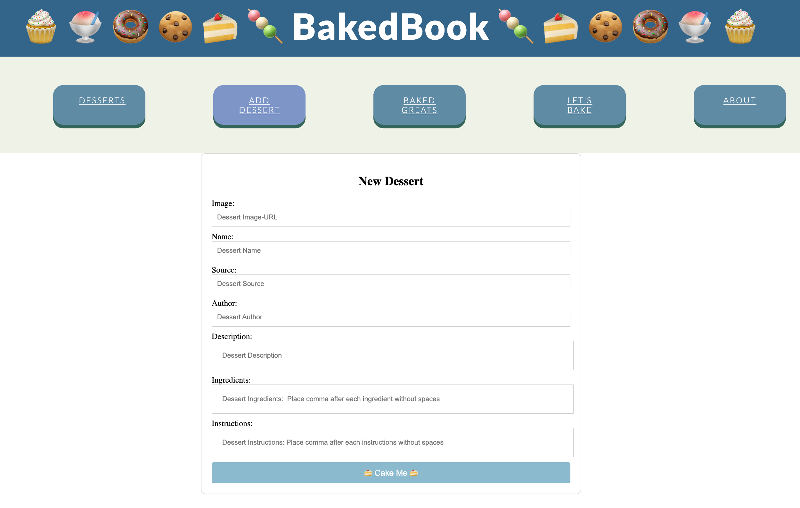

# baked-book

### Why bake goods, when you can bake greats!

# Getting Started with your own BakedBook!

## Available Scripts

In the project directory, you can run:

### `npm start`

Runs the app in the development mode.\
Open [http://localhost:8000](http://localhost:8000) to view it in your browser.

### `npm run server`

Runs a db.json server in the development mode.\
Open [http://localhost:8001/recipes](http://localhost:8001/recipes) to view it in your browser.

## Build your own BakedBook

#### Fork and Clone this repo and you can...

##### Have access to a super sweet display of desserts:

##### Add your own special recipe:

